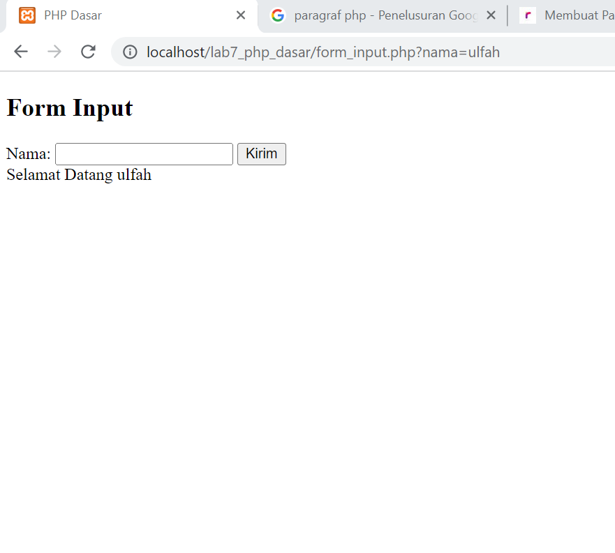

# Lab7Web
Nama    : Marifatul Ulfah
Nim     : 311910577
Kelas   : TI.20.B2

Praktikum PHP Dasar
Langkah-Langkah Praktikum
1. siapkan vscode
2. buka xampp
start Apache seperti pada gambar dibawah ini:

3. Buka file Explorer dan buat folder baru bernama lab7_php_dasar di Localdisk C/xampp/htdocs/lab7_php_dasar

4. Uji coba serversudah bekerja dengan baik atau belum dengan mengakses http://127.0.0.1 atau http://localhost
Jika tampilan awal nya menunjukan seperti gambar dibawah ini.artinya server sedang bekerja dengan baik.

5. Akses directory pada web server dengan mengakses URL: http://localhost/lab7_php_dasar/ pada google chrome

6. Tambahkan file baru dengan nama php_dasar.php pada direktory tersebut. dan isi mdengan tampilan seperti dibawah ini:

7. mengakses hasil melalui URL: http://localhost/lab7_php_dasar/php_dasar.php

8. mengakses hasil mdengan variabel Get dengan menggunakan URL: http://localhost/lab7_php_dasar/latihan2.php?nama=ulfah

# Membuat Form Input
buat folder baru Form_input.php di directory yang sama, kemudian isi dengan source code di form_input.php, dan akan menghasilkan tampilan seperti dibawah ini:

Tampilan Tugas dari form input, yaitu menampilkan Nama, pekerjaan dan juga tanggal lahir

Tampilan setelah di Submit

